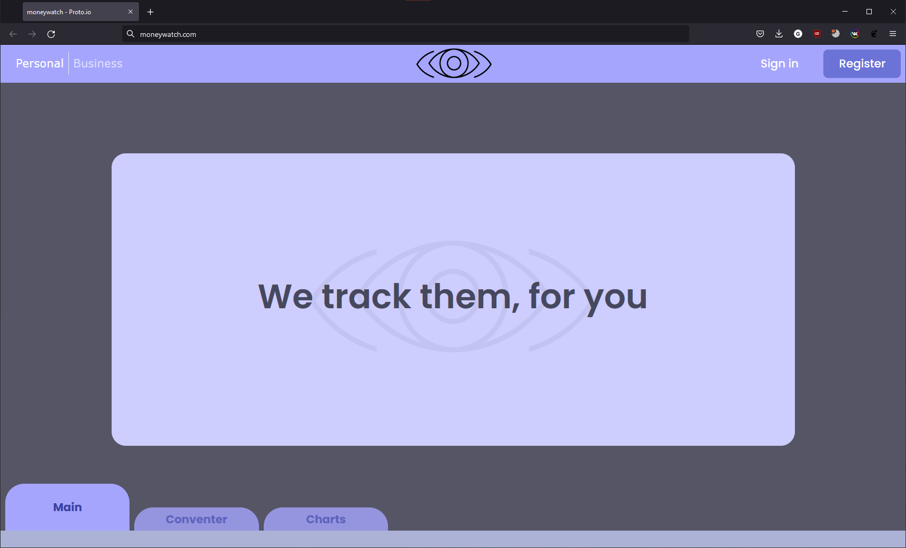
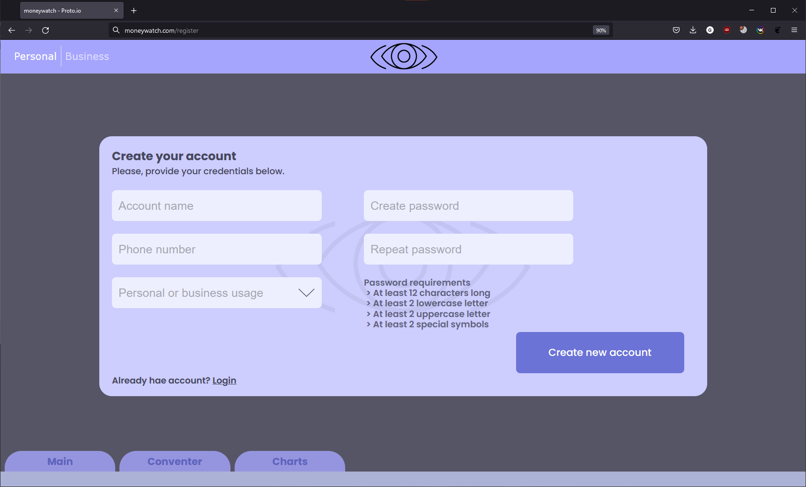
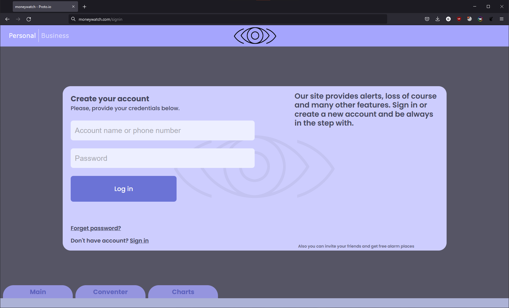
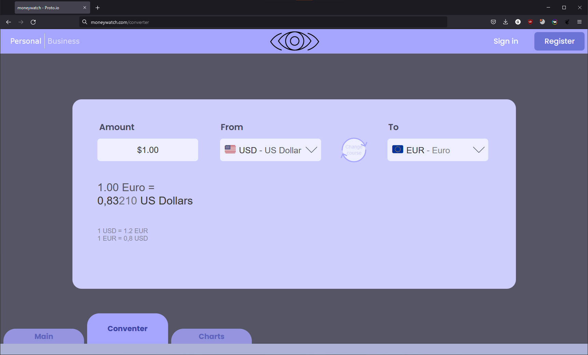
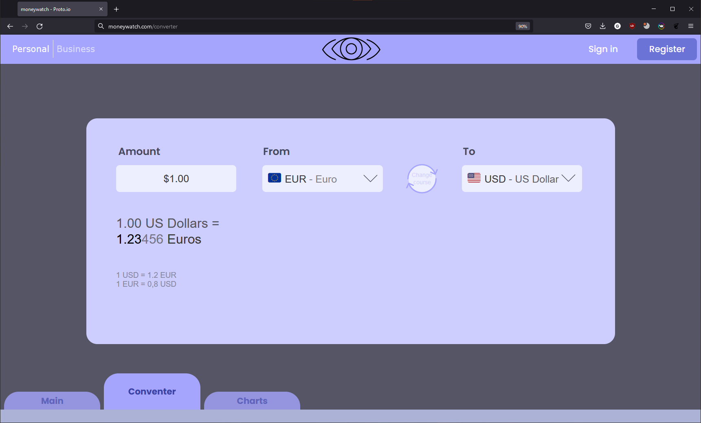
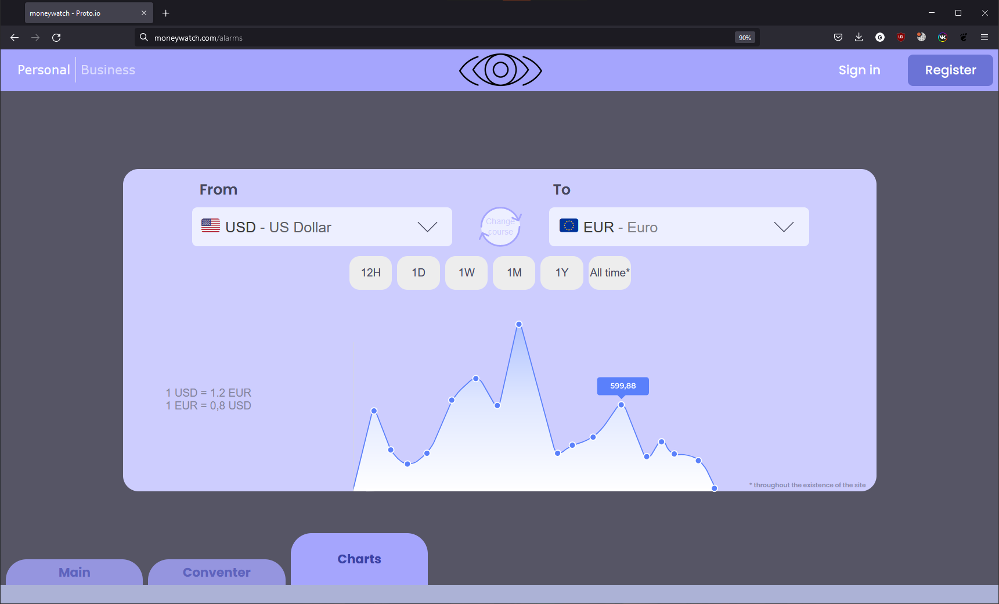
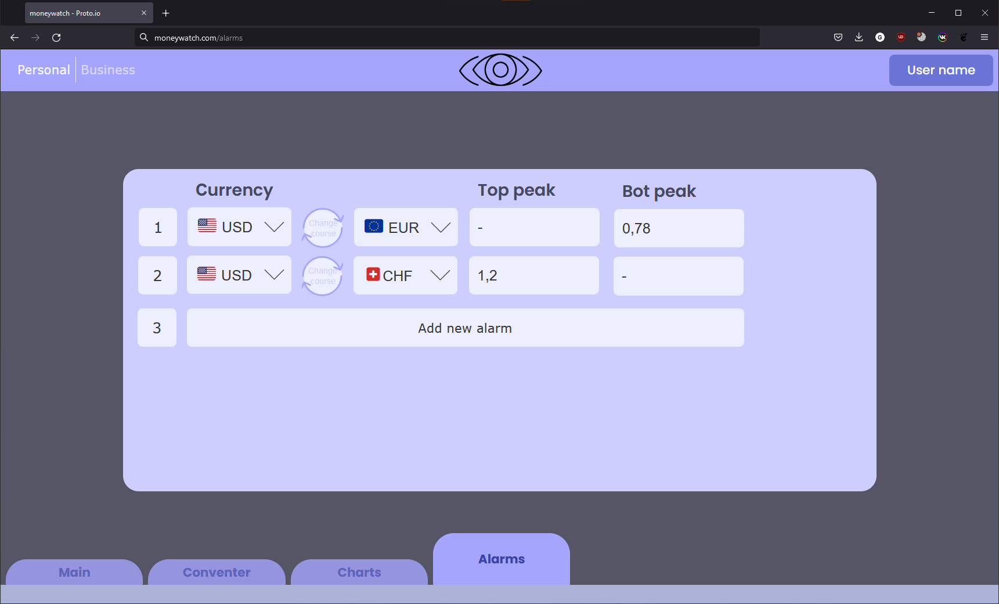

# Требования к проекту
---

## Содержание

1 [Введение](#intro)  
1.1 [Назначение](#appointment)  
1.2 [Бизнес-требования](#business_requirements)  
1.2.1 [Исходные данные](#initial_data)  
1.2.2 [Возможности бизнеса](#business_opportunities)  
1.2.3 [Границы проекта](#project_boundary)  
1.3 [Аналоги](#analogues)  
2 [Требования пользователя](#user_requirements)  
2.1 [Программные интерфейсы](#software_interfaces)  
2.2 [Интерфейс пользователя](#user_interface)  
2.3 [Характеристики пользователей](#user_specifications)  
2.3.1 [Классы пользователей](#user_classes)  
2.3.2 [Аудитория приложения](#application_audience)  
2.3.2.1 [Целевая аудитория](#target_audience)  
2.3.2.1 [Побочная аудитория](#collateral_audience)  
2.4 [Предположения и зависимости](#assumptions_and_dependencies)  
3 [Системные требования](#system_requirements)  
3.1 [Функциональные требования](#functional_requirements)  
3.1.1 [Основные функции](#main_functions)  
3.1.1.1 [Вход пользователя в приложение](#user_logon_to_the_application)  
3.1.1.2 [Настройка профиля активного пользователя](#setting_up_the_profile_of_the_active_user)  
3.1.1.3 [Загрузка новостей](#download_news)  
3.1.1.4 [Просмотр информации об отдельной новости](#view_information_about_an_individual_newsletter)  
3.1.1.5 [Выход пользователя из учётной записи](#active_user_change)  
3.1.1.6 [Регистрация нового пользователя после входа в приложение](#add_new_user)  
3.1.2 [Ограничения и исключения](#restrictions_and_exclusions)  
3.2 [Нефункциональные требования](#non-functional_requirements)  
3.2.1 [Атрибуты качества](#quality_attributes)  
3.2.1.1 [Требования к удобству использования](#requirements_for_ease_of_use)  
3.2.1.2 [Требования к безопасности](#security_requirements)  
3.2.2 [Внешние интерфейсы](#external_interfaces)  
3.2.3 [Ограничения](#restrictions)

<a name="intro"/>

# 1 Введение

<a name="appointment"/>

## 1.1 Назначение

В этом документе будут описаны функциональные и нефункциональные требования к
мультиплатформенному приложению "MoneyWatch". Этот документ предназначен для
команды, которая будет реализовывать и проверять корректность работы приложения.

<a name="business_requirements"/>

## 1.2 Бизнес-требования

<a name="initial_data"/>

### 1.2.1 Исходные данные

Множество людей любой возрастной категории зачастую нуждаются в получении
актуального курса валют для различных целей. Однако существующие аналоги либо
сложны для восприятия пользователем, либо страдают от нехватки того или иного
функционала В связи с этим, с курсом валют зачастую возникают недопонимания, к
примеру, в каком обменнике выгоднее менять деньги, в какую валюту на данный
момент сейчас лучше вкладываться и как поменять деньги по интернету. Из этого
следует, что большинству нужно просто зайти в приложение или на сайт и узнать
именно ту информацию, что им нужна, будь то просто курс валют или же
архаизированные курсы. Наши разработчики будут добиваться того, чтобы человек с
любым навыком использования компьютера или телефона смог интуитивно разобраться
в нашем приложении.
<a name="business_opportunities"/>

### 1.2.2 Возможности бизнеса

Большинство людей хотят иметь возможность мгновенного получения информации об
актуальном курсе валют, графиках колебания курса или же утечках, причём люди эти
могут быть абсолютно любого уровня технической грамотности. Подобное приложение
позволит им тратить намного меньше времени на поиск необходимой валюты, банка и
истории. Интерфейс, спроектированный с учётом этих особенностей, и своевременная
поддержка приложения позволят увеличить приток пользователей данного приложения
многократно. Будет прилагаться возможность ставить уведомления на курс
каких-то валют. При персональном аккаунте максимальное количество
уведомлений может достигать до 3 штук бесплатных и до 10 штук платных. При
бизнес-аккаунте ограничение на уведомления снимаются. Кроме этого, на нашем
сайте будет список всех актуальных криптовалют с их конвертацией в
государственные валюты.
<a name="project_boundary"/>

### 1.2.3 Границы проекта

Приложение без обязательной регистрации "MoneyDepo" позволит пользователям
просматривать актуальные курсы валют, рассчитывать выгоднейший обмен, смотреть
графики курсов в прошлом. Также в приложении будет необязательная регистрация,
которая позволит ставить специфичные настройки для каждого пользователя, к
примеру, уведомления, когда курс какой-то из валют достигает некоторой границы.
<a name="analogues"/>

## 1.3 Аналоги

Обзор аналогов приведён в
документе [overview_of_analogues](./Requirements/overview_of_analogues.md).

<a name="user_requirements"/>

# 2 Требования пользователя

<a name="software_interfaces"/>

## 2.1 Программные интерфейсы

Интернет-версия приложения будет размещена на локальном хостинге и будет
написана на rust на фреймворке rocket. Десктоп версия будет написана на
языке Python с использованием библиотеки Qt6.

<a name="user_interface"/>

## 2.2 Интерфейс пользователя

Главный экран сайта.  
  
Окно регистрации нового пользователя.  
  
Окно входа для зарегистрированного пользователя.  

Окно конвертера валют

Окно конвертера после нажатия кнопки переключения курса

Окно графика курса валют
Окно уведомлений о курсе для
зарегистрированных пользователей

<a name="user_specifications"/>

## 2.3 Характеристики пользователей

<a name="user_classes"/>

### 2.3.1 Классы пользователей

| Класс пользователей             | Описание                                                                                                                        |
|:--------------------------------|:--------------------------------------------------------------------------------------------------------------------------------|
| Анонимные пользователи          | Пользователи, которые не хотят регистрироваться в приложении. Имеют доступ к частичному функционалу.                            |
| Зарегистрированные пользователи | Пользователи, которые вошли в приложение под своим именем. Имеют доступ к полному функционалу. Могут ставить уведомления курсов |

<a name="application_audience"/>

### 2.3.2 Аудитория приложения

<a name="target_audience"/>

#### 2.3.2.1 Целевая аудитория

Люди любой возрастной категории, обладающие минимальными навыками работы с
ПК, интересующиеся актуальными курсами валют и уведомлениями, связанными с ними.

<a name="collateral_audience"/>

#### 2.3.2.2 Побочная аудитория

Люди средней возрастной категории, бизнесмены, заинтересованные в заработке
на курсах валют.

<a name="assumptions_and_dependencies"/>

## 2.4 Предположения и зависимости

1. Приложение не работает при отсутствии подключения к Интернету;
2. Приложение не позволяет добавить новые уведомления, если места закончились.